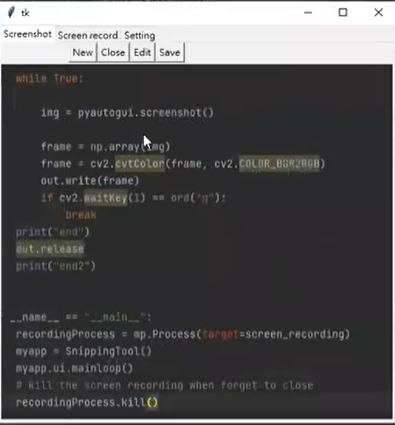
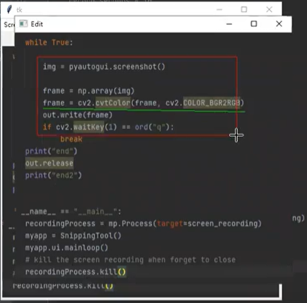
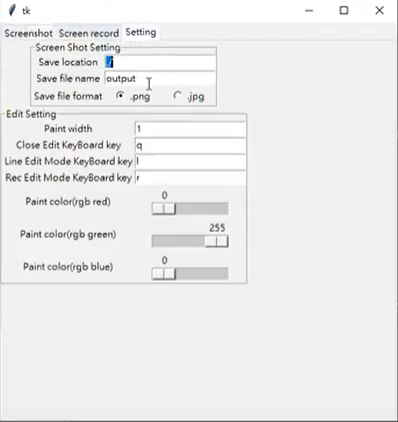

# snipping-tool-clone
This project is trying to clone the window snipping tool by python. It include the function of screenshot in a selected area, edit the screenshot by drawing line on it. We can also have some setting in it, such as change the drawing color.

# Sample run video
[sample run video](https://drive.google.com/file/d/1lziI2dLh_R44-rJOrX4eTcocWidhjOb7/view?usp=sharing)

# product function

## Screenshot and save it

## Simple edit on the screenshot

## Customize setting on the product

# Thank you for reading this repo

